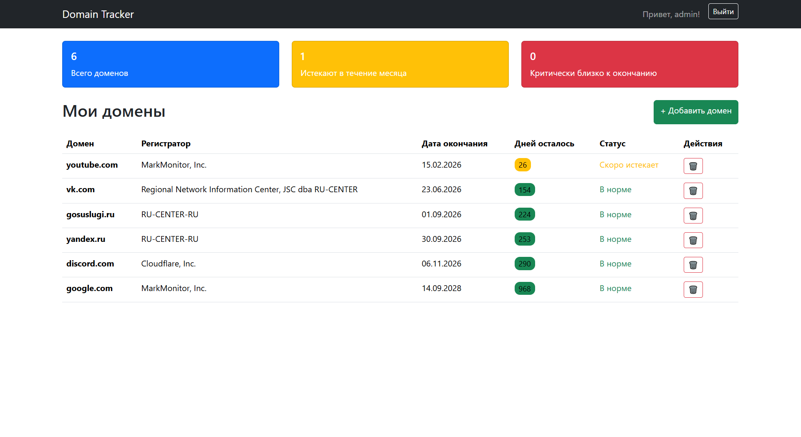
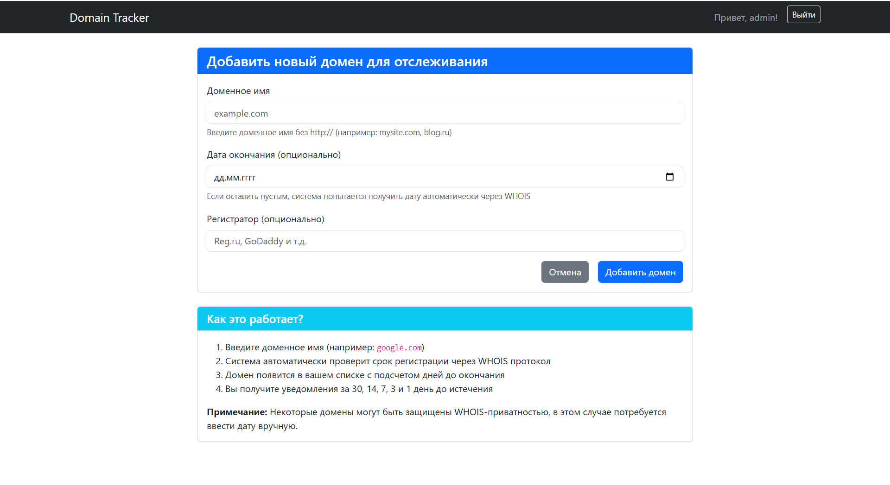
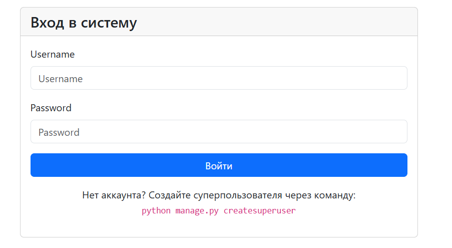
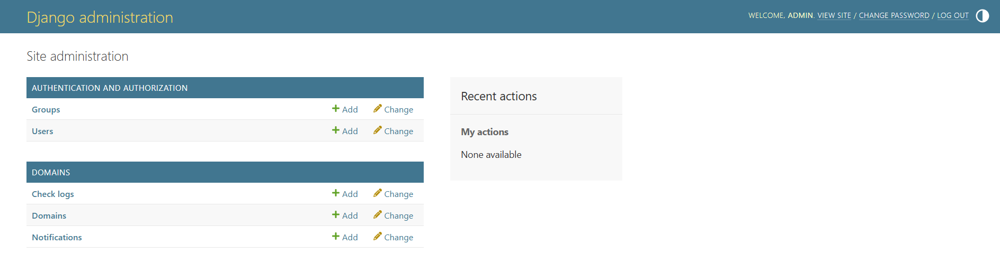

Domain Expiry Tracker
Domain Expiry Tracker — это веб-сервис для мониторинга сроков регистрации доменов, который помогает веб-мастерам, разработчикам и владельцам сайтов никогда не терять свои домены из-за забывчивости. Сервис автоматически проверяет даты окончания регистрации через WHOIS протокол, отслеживает оставшееся время и визуально выделяет домены, которые скоро истекают.

Ссылка на рабочий проект: https://multiversecup.pythonanywhere.com/

# 🌟 Особенности

Автоматическая проверка WHOIS: Система сама получает даты окончания регистрации

Визуальная индикация: Цветовые статусы показывают срочность продления

Email-уведомления: Оповещения за 30, 14, 7, 3 и 1 день до истечения срока

Защита данных: Каждый пользователь видит только свои домены

Удобное управление: Добавление и удаление доменов в один клик

Полная статистика: Просмотр количества доменов по статусам

# 🛠️ Технологии
Backend:

Python 3.10+

Django 4.2

Django ORM для работы с базой данных

Frontend:

Bootstrap 5 для адаптивного дизайна

HTML5, CSS3, JavaScript (ES6+)

Интеграции:

python-whois для получения данных WHOIS

Django Authentication System для безопасности

База данных:

SQLite (разработка)

PostgreSQL (продакшен)

Хостинг:

PythonAnywhere для деплоя

# 📸 Скриншоты
1. Главная страница со списком доменов

Таблица доменов с цветовой индикацией, статистикой и кнопками управления

2. Добавление нового домена

Форма для добавления домена с автоматической WHOIS-проверкой

3. Страница входа

Аутентификация пользователей с поддержкой сессий

4. Админ-панель

Панель администратора для управления пользователями и доменами

🚀 Как запустить проект локально
Предварительные требования
Python 3.10 или выше

pip (менеджер пакетов Python)

Git (для клонирования репозитория)

Пошаговая инструкция
Клонируйте репозиторий:

git clone https://github.com/MultiverseCup/DomainMonitoringApp.git

cd DomainMonitoringApp

Создайте и активируйте виртуальное окружение:

python -m venv venv

venv\Scripts\activate

pip install -r requirements.txt

Выполните миграции базы данных:

python manage.py makemigrations

python manage.py migrate

Создайте суперпользователя для доступа к админке:

python manage.py createsuperuser

(Следуйте инструкциям для создания учетной записи администратора)

Запустите сервер разработки:

python manage.py runserver
Откройте проект в браузере:

Основное приложение: http://127.0.0.1:8000

Админ-панель: http://127.0.0.1:8000/admin

# 📊 Модели данных
Проект использует 3 основные модели:

Domain - хранение информации о доменах пользователей

Notification - управление уведомлениями

CheckLog - история проверок WHOIS

# 🔧 Функциональность

Для пользователей:

✅ Регистрация и аутентификация

✅ Добавление доменов с автоматической WHOIS-проверкой

✅ Просмотр списка доменов с цветовой индикацией

✅ Удаление доменов с подтверждением

✅ Получение email-уведомлений

Для администраторов:

✅ Полный контроль через админ-панель Django

✅ Управление пользователями и доменами

✅ Просмотр логов проверок

✅ Мониторинг активности системы
